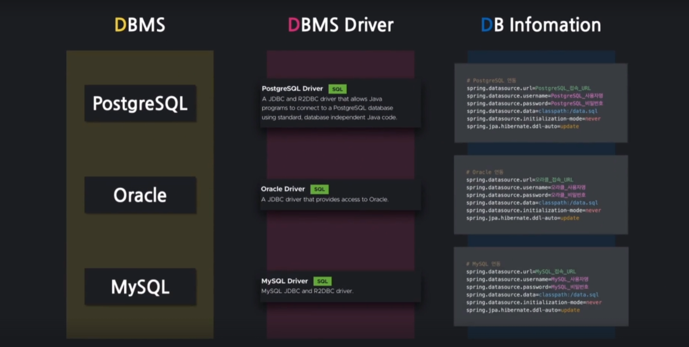
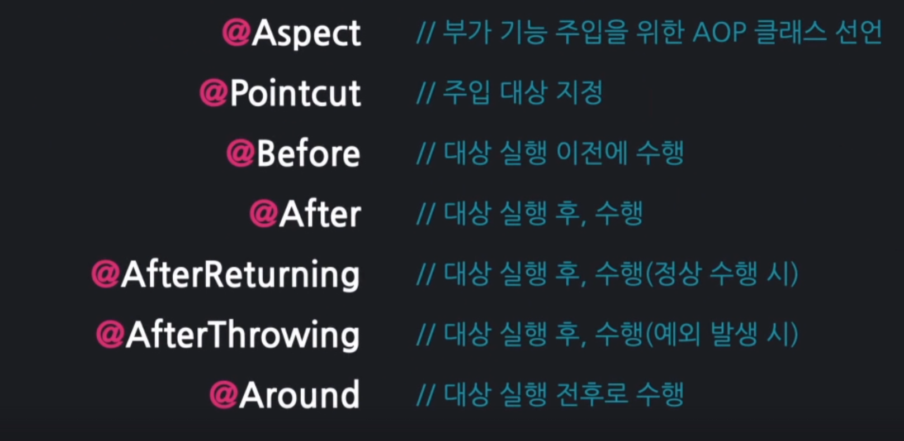
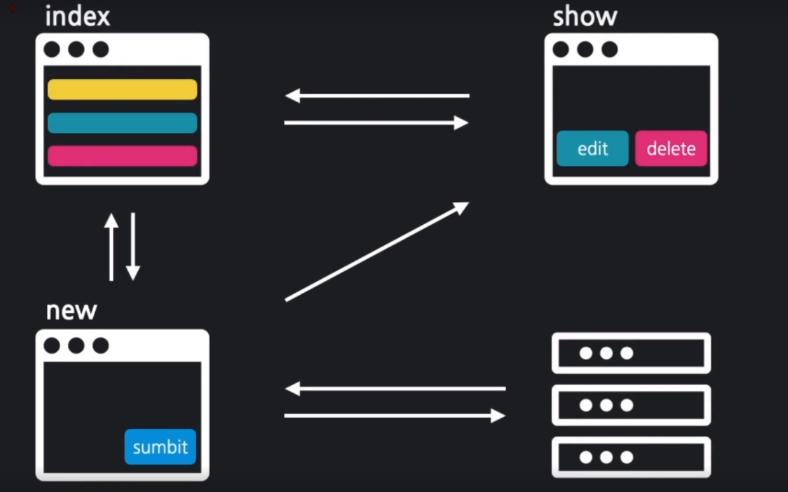
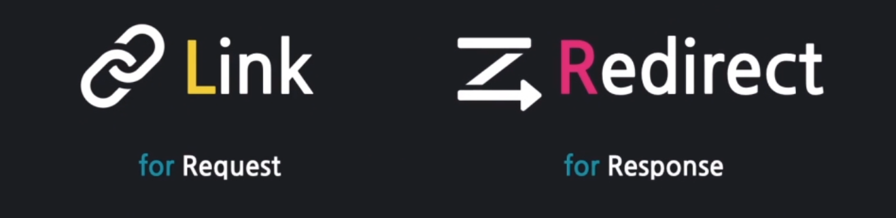
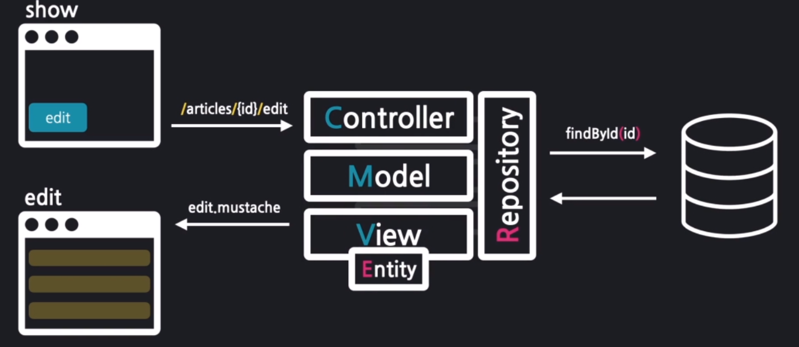

# first

## 목차
1. [WebService 동작 원리](#web-service-동작원리)
2. [Vue Templete & MVC Patten](#vue-템플릿-과-mvc-패턴)


### Web Service 동작원리
- 클라이언트 : 서비스를 사용하는 프로그램 또는 컴퓨터
- 서버 : 서비스를 제공하는 프로그램 또는 컴퓨터

&rarr;
클라이언트가 서버에 요청을 하게 되면 서버는 해당 요청을 응답으로 전해준다.

### Vue 템플릿과 MVC 패턴
<details>
<summary>자세히 보기</summary>

- Vue 템블릿 : 화면을 담당하는 기술
    - 틀이되는 페이지가 변수의 값에 따라서 수많은 페이지로 바뀔 수 있음
    - Controller : 처리
    - Model : data
    - Mustache : Vue 템블릿 엔진


- MVC 패턴 : 화면, 처리, 데이터 분야를 각 담당자별로 나누는 기법

- 정리
  <br>

  클라이언트 :
  http://localhost:8080/hi   
  &nbsp;&nbsp;&nbsp;&nbsp;&nbsp;&nbsp;&nbsp;&darr;
  ```java
  @Controller
  public class FirstController {

    @GetMapping("/hi") // localhost:8081/hi
    public String niceToMeetYou(Model model){
        model.addAttribute("username","won yong"); // (변수,값)
        return "greetings"; // templates/greetings.mustache -> 브라우저로 전송 (뷰 페이지 이름)
    }
  }
  ```
  &nbsp;&nbsp;&nbsp;&nbsp;&nbsp;&nbsp;&nbsp;&darr;
  <table>
  <tr>
    <td>key</td>
    <td>value</td>
  </tr>
  <tr><td>username</td><td>won yong</td></tr>
  </table>

  &nbsp;&nbsp;&nbsp;&nbsp;&nbsp;&nbsp;&nbsp; &darr;
  ```html
  <html>
  <head>
      <meta charset="UTF-8">
      <meta name="viewport"
            content="width=device-width, user-scalable=no, initial-scale=1.0, maximum-scale=1.0, minimum-scale=1.0">
      <meta http-equiv="X-UA-Compatible" content="ie=edge">
      <title>Document</title>
  </head>
  <body>
      <h1>{{username}}님, 반갑습니다!</h1>
  </body>
  </html>
  ```
  &nbsp;&nbsp;&nbsp;&nbsp;&nbsp;&nbsp;&nbsp;&darr;
</details>
  

### model, view , controller 역할
<details>
<summary>자세히 보기</summary>

 ```java
    @Controller
  public class FirstController {
    @GetMapping("/bye")
    public String seeBob(Model model){
    model.addAttribute("nickname","won yong");
    return "goodday"; //templates
    }
  }
 ```

  &nbsp;&nbsp;&nbsp;&nbsp;&nbsp;&nbsp;&nbsp; &darr;
  ```html
    <html>
  <head>
      <meta charset="UTF-8">
      <meta name="viewport"
            content="width=device-width, user-scalable=no, initial-scale=1.0, maximum-scale=1.0, minimum-scale=1.0">
      <meta http-equiv="X-UA-Compatible" content="ie=edge">
      <title>Document</title>
  </head>
  <body>
      <h1>{{nickname}}님, 다음에 밥</h1>
  </body>
  </html>
   ```

</details>

### 화면요소 Layout
<details>
<summary>자세히 보기</summary>

header : navigation
<br>
content
<br>
footer : information


</details>

### 폼 데이터 주고받기

<details>
<summary>자세히 보기</summary>

1. Create

  - form 데이터를 받는 객체 -> DTO
<br>
  #### 입력 폼 만들기

<br>


#### JPA
Client -> DTO -> Controller -> Entity -> repository -> save() -> db

```java
 // 1. Dto를 변환! Entity!
    Article article = form.toEntity();
```    
```java
 // 2. Repository에게 Enbtity를 DB안에 저장하게 함!
    Article saved = articleRepository.save(article);
```

### DB접근

 - h2 DB, 웹 콘솔 접근 허용 : spring.h2.console.enabled=true
<br>

 - web 접속 :  http://localhost:8081/h2-console


</details>

## Lombok 과 리팩토링
<details>
<summary>자세히 보기</summary>

  Lombok

 - 코드 간소화
 - 코드 수행과정 기록
 - 코드 리팩토링

  Lombok 추가
 - 경로 -> bulid.gradle -> dependencies
 - compileOnly 'org.projectlombok:lombok' 추가
 - annotationProcessor 'org.projectlombok:lombok' 추가

  리팩토링
  #### dto,Entity
  - @AllArgsConstructor
  - @ToString

  #### controller
  - @Slf4j
  - println -> log.info로 대체사용
</details>

## 데이터 조회

  <details>
  <summary>자세히 보기</summary>
  
  
  
  url 요청
  - 받아올때 getMapping,@PathVariable 로받음

 1: id로 데이터를 가져옴
  - Article articleEntity = articleRepository.findById(id).orElse(null);

 2: 가져온 데이터를 모델에 등록
  - model.addAttribute("article", articleEntity);

 3: 보여줄 페이지를 설정
  - return "articles/show";

 @NoArgsConstructor // 디폴트 생성자를 추가

  </details>

## 데이터 목록 조회 

  <details>
  <summary>자세히 보기</summary>
  
  

  #### 1: 모든 Article을 가져온다
  ```java
  List<Article> articleEntityList = articleRepository.findAll();
  ```

  #### ArticleRepository
  ```java
  @Override
    ArrayList<Article> findAll();
  ```  

  #### 2: 가져온 Article 묶음을 뷰로 전달
  ```java
  model.addAttribute("articleList", articleEntityList);
  ```
  #### 3: 뷰 페이지를 설정 (index.mustache)
  ```java
  return "articles/index";
  ```
  
  
  
  
  </details>

## 링크와 리다이렉트

 <details>
  <summary>자세히 보기</summary>

  ### 링크와 리다이렉트를 사용하여 페이지간 이동을 연결하시오
  
  <br><br><br>
  
  #### Link
  - a , form 태그
  ```java
  <a href=""> </a>
  ```

  #### Redirect
  클라이언트에게 재요청  
  ```java
  return "redirect:/articles/" + saved.getId(); 
  ```

  #### 목록보기 링크달기
  ```html
  <td><a href="/articles/{{id}}">{{title}}</a></td>
  ```

</details>

## 수정 폼 만들기

<details>
<summary>자세히 보기</summary>

### 데이터 수정 페이지 만들기



  #### 수정할 데이터를 가져오기
  ```java
    Article articleEntity = articleRepository.findById(id).orElse(null);
  ```
    
  #### 모델에 데이터를 등록
  ```java
     model.addAttribute("article", articleEntity);
  ```
  
  #### 뷰 페이지 설정
  ```java
  return "articles/edit";
  ```
  
  #### edit.mustache
  
  form {{#article}} {{/article}}
  <br>
  제목 value="{{article.title}}
  <br>
  내용
  {{article.content}}
  

</details>

## 데이터 수정하기

<details>
<summary>자세히 보기</summary>
  
  spring boot 2.5버전부터는 date.sql이 먼저 실행됌

  spring.jpa.defer-datasource-initialization=true <- 어플리케이션 프로퍼티즈에 추가


#### 1. DTO를 엔티티로 변환

  ```java
  Article articleEntity = form.toEntity();
  ```

#### 2. 엔티티를 DB로 저장
#### 2-1: DB에서 기존 데이터를 가져온다
  ```java 
    Article target = articleRepository.findById(articleEntity.getId()).orElse(null);
  ```

#### 2-2: 기존 데이터의 값을 갱신한다
```java
  if(target != null) {
  articleRepository.save(articleEntity); // 엔티티가 DB로 갱신
  }
```
#### 3. 수정 결과 페이지로 리다이렉트한다
```java
  return "redirect:/articles/" + articleEntity.getId();
```


#### edit.mustache
 - 임시로 post방식
 - action : articles/update로 수정

원래는 post방식이 아니라 patch로 해야함 

</details>