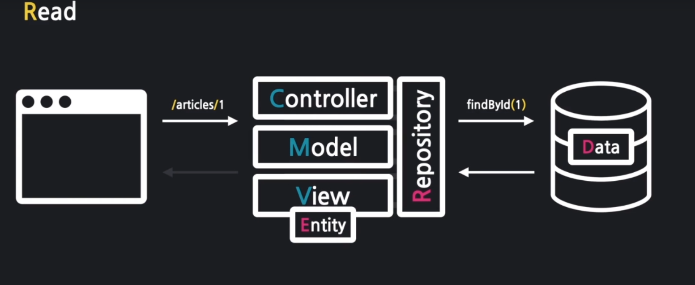
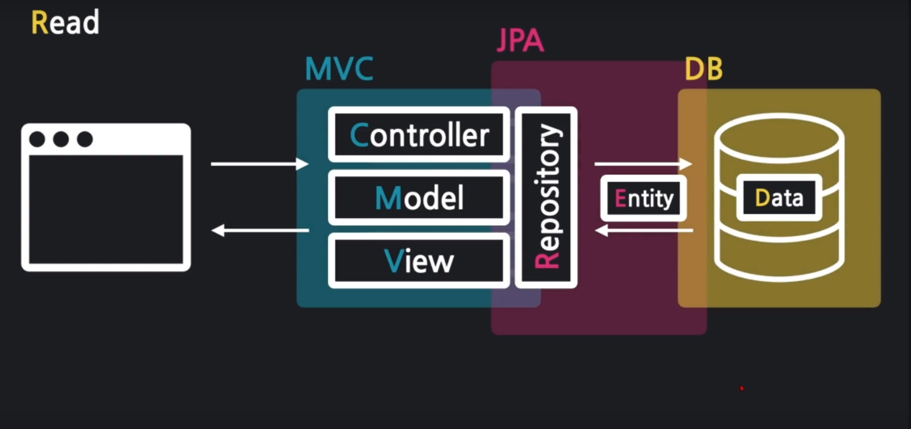
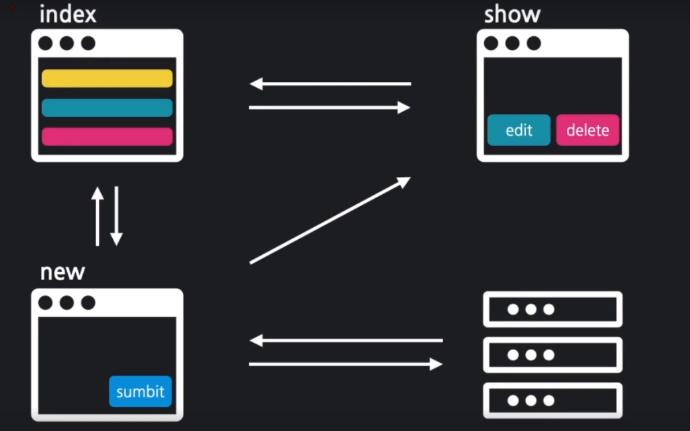
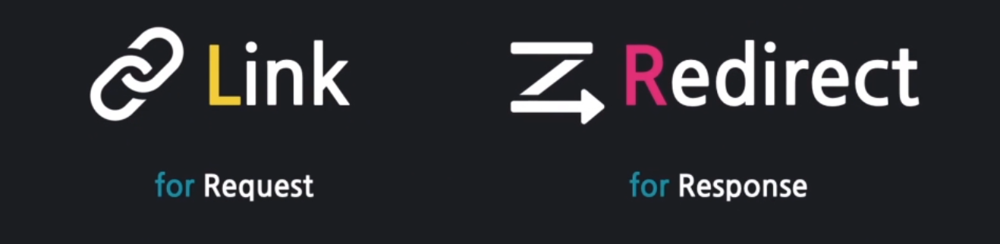
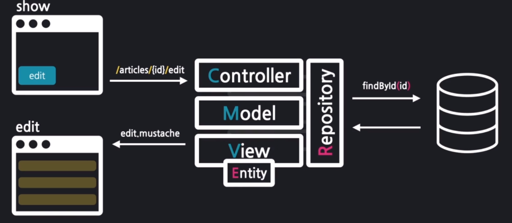
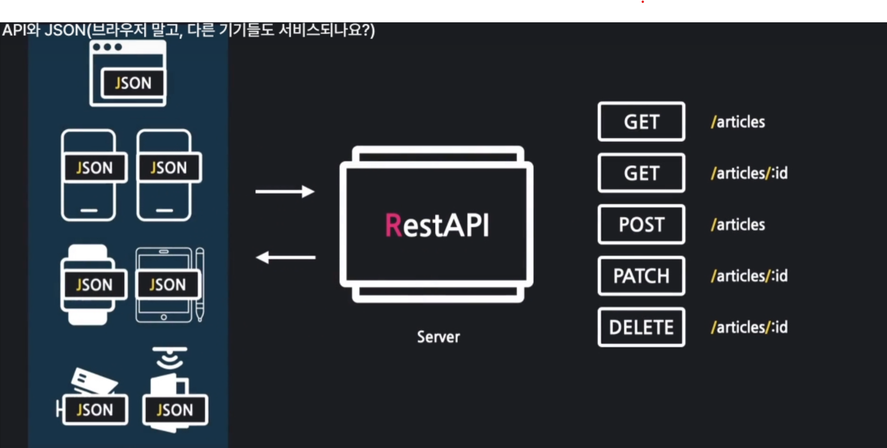
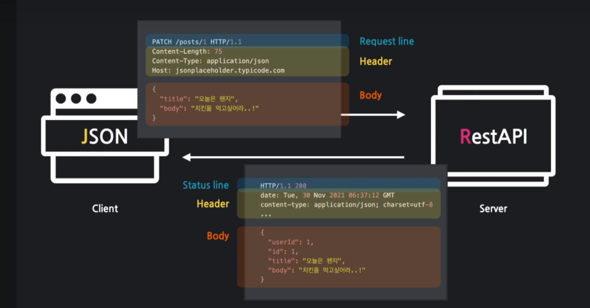
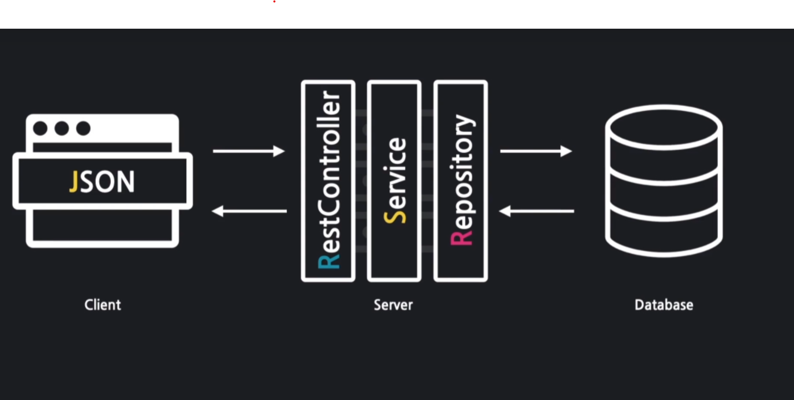
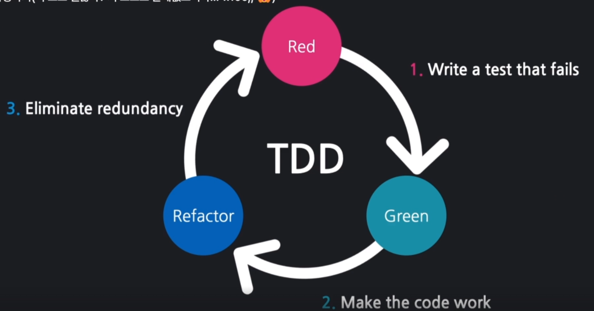

# first

## 목차
1. [WebService 동작 원리](#web-service-동작원리)
2. [Vue Templete & MVC Patten](#vue-템플릿-과-mvc-패턴)


### Web Service 동작원리
- 클라이언트 : 서비스를 사용하는 프로그램 또는 컴퓨터
- 서버 : 서비스를 제공하는 프로그램 또는 컴퓨터

&rarr;
클라이언트가 서버에 요청을 하게 되면 서버는 해당 요청을 응답으로 전해준다.

### Vue 템플릿과 MVC 패턴
<details>
<summary>자세히 보기</summary>

- Vue 템블릿 : 화면을 담당하는 기술
    - 틀이되는 페이지가 변수의 값에 따라서 수많은 페이지로 바뀔 수 있음
    - Controller : 처리
    - Model : data
    - Mustache : Vue 템블릿 엔진


- MVC 패턴 : 화면, 처리, 데이터 분야를 각 담당자별로 나누는 기법

- 정리
  <br>

  클라이언트 :
  http://localhost:8080/hi   
  &nbsp;&nbsp;&nbsp;&nbsp;&nbsp;&nbsp;&nbsp;&darr;
  ```java
  @Controller
  public class FirstController {

    @GetMapping("/hi") // localhost:8081/hi
    public String niceToMeetYou(Model model){
        model.addAttribute("username","won yong"); // (변수,값)
        return "greetings"; // templates/greetings.mustache -> 브라우저로 전송 (뷰 페이지 이름)
    }
  }
  ```
  &nbsp;&nbsp;&nbsp;&nbsp;&nbsp;&nbsp;&nbsp;&darr;
  <table>
  <tr>
    <td>key</td>
    <td>value</td>
  </tr>
  <tr><td>username</td><td>won yong</td></tr>
  </table>

  &nbsp;&nbsp;&nbsp;&nbsp;&nbsp;&nbsp;&nbsp; &darr;
  ```html
  <html>
  <head>
      <meta charset="UTF-8">
      <meta name="viewport"
            content="width=device-width, user-scalable=no, initial-scale=1.0, maximum-scale=1.0, minimum-scale=1.0">
      <meta http-equiv="X-UA-Compatible" content="ie=edge">
      <title>Document</title>
  </head>
  <body>
      <h1>{{username}}님, 반갑습니다!</h1>
  </body>
  </html>
  ```
  &nbsp;&nbsp;&nbsp;&nbsp;&nbsp;&nbsp;&nbsp;&darr;
</details>
  

### model, view , controller 역할
<details>
<summary>자세히 보기</summary>

 ```java
    @Controller
  public class FirstController {
    @GetMapping("/bye")
    public String seeBob(Model model){
    model.addAttribute("nickname","won yong");
    return "goodday"; //templates
    }
  }
 ```

  &nbsp;&nbsp;&nbsp;&nbsp;&nbsp;&nbsp;&nbsp; &darr;
  ```html
    <html>
  <head>
      <meta charset="UTF-8">
      <meta name="viewport"
            content="width=device-width, user-scalable=no, initial-scale=1.0, maximum-scale=1.0, minimum-scale=1.0">
      <meta http-equiv="X-UA-Compatible" content="ie=edge">
      <title>Document</title>
  </head>
  <body>
      <h1>{{nickname}}님, 다음에 밥</h1>
  </body>
  </html>
   ```

</details>

### 화면요소 Layout
<details>
<summary>자세히 보기</summary>

header : navigation
<br>
content
<br>
footer : information


</details>

### 폼 데이터 주고받기

<details>
<summary>자세히 보기</summary>

1. Create

  - form 데이터를 받는 객체 -> DTO
<br>
  #### 입력 폼 만들기

<br>


#### JPA
Client -> DTO -> Controller -> Entity -> repository -> save() -> db

```java
 // 1. Dto를 변환! Entity!
    Article article = form.toEntity();
```    
```java
 // 2. Repository에게 Enbtity를 DB안에 저장하게 함!
    Article saved = articleRepository.save(article);
```

### DB접근

 - h2 DB, 웹 콘솔 접근 허용 : spring.h2.console.enabled=true
<br>

 - web 접속 :  http://localhost:8081/h2-console


</details>

## Lombok 과 리팩토링
<details>
<summary>자세히 보기</summary>

  Lombok

 - 코드 간소화
 - 코드 수행과정 기록
 - 코드 리팩토링

  Lombok 추가
 - 경로 -> bulid.gradle -> dependencies
 - compileOnly 'org.projectlombok:lombok' 추가
 - annotationProcessor 'org.projectlombok:lombok' 추가

  리팩토링
  #### dto,Entity
  - @AllArgsConstructor
  - @ToString

  #### controller
  - @Slf4j
  - println -> log.info로 대체사용
</details>

## 데이터 조회

  <details>
  <summary>자세히 보기</summary>
  
  
  
  url 요청
  - 받아올때 getMapping,@PathVariable 로받음

 1: id로 데이터를 가져옴
  - Article articleEntity = articleRepository.findById(id).orElse(null);

 2: 가져온 데이터를 모델에 등록
  - model.addAttribute("article", articleEntity);

 3: 보여줄 페이지를 설정
  - return "articles/show";

 @NoArgsConstructor // 디폴트 생성자를 추가

  </details>

## 데이터 목록 조회 

  <details>
  <summary>자세히 보기</summary>
  
  

  #### 1: 모든 Article을 가져온다
  ```java
  List<Article> articleEntityList = articleRepository.findAll();
  ```

  #### ArticleRepository
  ```java
  @Override
    ArrayList<Article> findAll();
  ```  

  #### 2: 가져온 Article 묶음을 뷰로 전달
  ```java
  model.addAttribute("articleList", articleEntityList);
  ```
  #### 3: 뷰 페이지를 설정 (index.mustache)
  ```java
  return "articles/index";
  ```
  
  
  
  
  </details>

## 링크와 리다이렉트

 <details>
  <summary>자세히 보기</summary>

  ### 링크와 리다이렉트를 사용하여 페이지간 이동을 연결하시오
  
  <br><br><br>
  
  #### Link
  - a , form 태그
  ```java
  <a href=""> </a>
  ```

  #### Redirect
  클라이언트에게 재요청  
  ```java
  return "redirect:/articles/" + saved.getId(); 
  ```

  #### 목록보기 링크달기
  ```html
  <td><a href="/articles/{{id}}">{{title}}</a></td>
  ```

</details>

## 수정 폼 만들기

<details>
<summary>자세히 보기</summary>

### 데이터 수정 페이지 만들기



  #### 수정할 데이터를 가져오기
  ```java
    Article articleEntity = articleRepository.findById(id).orElse(null);
  ```
    
  #### 모델에 데이터를 등록
  ```java
     model.addAttribute("article", articleEntity);
  ```
  
  #### 뷰 페이지 설정
  ```java
  return "articles/edit";
  ```
  
  #### edit.mustache
  
  form {{#article}} {{/article}}
  <br>
  제목 value="{{article.title}}
  <br>
  내용
  {{article.content}}
  

</details>

## 데이터 수정하기

<details>
<summary>자세히 보기</summary>
  
  spring boot 2.5버전부터는 date.sql이 먼저 실행됌

  spring.jpa.defer-datasource-initialization=true <- 어플리케이션 프로퍼티즈에 추가


#### 1. DTO를 엔티티로 변환

  ```java
  Article articleEntity = form.toEntity();
  ```

#### 2. 엔티티를 DB로 저장
#### 2-1: DB에서 기존 데이터를 가져온다
  ```java 
    Article target = articleRepository.findById(articleEntity.getId()).orElse(null);
  ```

#### 2-2: 기존 데이터의 값을 갱신한다
```java
  if(target != null) {
  articleRepository.save(articleEntity); // 엔티티가 DB로 갱신
  }
```
#### 3. 수정 결과 페이지로 리다이렉트한다
```java
  return "redirect:/articles/" + articleEntity.getId();
```


#### edit.mustache
 - 임시로 post방식
 - action : articles/update로 수정

원래는 post방식이 아니라 patch로 해야함 

</details>


## 데이터 삭제

<details>
<summary>자세히 보기</summary>

### Delete

- mustache 에 delete 태그 추가


####  1: 삭제 대상을 가져온다
```java 
  Article target = articleRepository.findById(id).orElse(null);
          log.info(target.toString());
```

#### 2: 대상을 삭제 한다

```java
  if(target != null){
  articleRepository.delete(target);
  rttr.addFlashAttribute("msg","삭제 완료");
  }
```

#### 3: 결과 페이지로 리다이렉트 한다
```java
    return "redirect:/articles";
```
   
#### header에 추가     
```html
<!-- alert -->
{{#msg}}
    <div class="alert alert-primary alert-dismissible">
        {{msg}}
        <button type="button" class="btn-close" data-bs-dismiss="alert" aria-label="Close"></button>
    </div>
{{/msg}}
```

</details>

## CRUD와 SQL 쿼리

<details>
<summary>자세히 보기</summary>

### 쿼리문
- insert
- select
- update
- delete

<br>

- application properties 설정
```java
# JPA 로깅 설정
# 디버그 레벨로 쿼리 출력
logging.level.org.hibernate.SQL=DEBUG
# 이쁘게 보여주기
spring.jpa.properties.hibernate.format_sql=true
# 파라미터 보여주기
logging.level.org.hibernate.type.descriptor.sql.BasicBinder=TRACE

# DB URL 고정 설정
# 유니크 URL 생성 X
spring.datasource.generate-unique-name=false
# 고정 url 설정
spring.datasource.url=jdbc:h2:mem:testdb
```

</details>

## REST API & JSON

<details>
<summary>자세히 보기</summary>

!

### REST API

- 애플리케이션이나 디바이스가 서로간의 연결하여 통신 할수있는 방법
- json 형식으로 통일되는 추세

### xml
- 사용자 정의형 html


### json
- 자바스크립트 표현한 객체표현식
- { key,value,..}
<br>

- 관광공사 api 받아올때와같음
```java
// 자바스크립트
fetch('https://jsonplaceholder.typicode.com/todos/1')
      .then(response => response.json())
      .then(json => console.log(json))

-> //output json데이터
        {
        "userId": 1,
        "id": 1,
        "title": "delectus aut autem",
        "completed": false
        }
```

- 200: 응답 성공
- 201: 쓰기,넣기 성공
- 404: 사이트 존재 X
- 500: 서버 문제 발생

### TAlend API 확장 프로그램사용
- POST, GET, PATCH, DELETE


</details>

## HTTP와 RestController(REST API, 어떻게 만들죠?)
<details>
<summary>자세히 보기</summary>

!

### 일반 컨트롤러 
- vue 반환

### REST 컨트롤러
- json 반환

### POST 방식 null 해결
- 빌드 gradle 로 바꿈

### POSTMAPPING
- @RequestBody 를 통해 Request의 body에 있는 내용을 ArticleForm에 담는다.

### PACTHMAPPING
- 1. 수정용 엔티티 생성
- 2. 대상 엔티티 조회
- 3. 잘못된 요청 처리 (대상이 없거나, id가 다른경우)
```java
if (target == null || id != article.getId()){
            // 400, 잘못된 요청 응답
            log.info("잘못된 요청 id: {}, article: {}", id, article.toString());
            return ResponseEntity.status(HttpStatus.BAD_REQUEST).body(null);
        }
```
- 4. 업데이트 및 정상 응답
```java
target.patch(article);
        Article updated = articleRepository.save(target);
        return ResponseEntity.status(HttpStatus.OK).body(updated);
    }
```
```java
// article 에 patch 메서드생성
public void patch(Article article) {
        if(article.title != null)
            this.title = article.title;
        if(article.content != null)
            this.content = article.content;

    }
```

### DELETEMAPPING
- 1. 대상 찾기
- 2. 잘못된 요청 처리
- 3. 대상 삭제

</details>

## 서비스 계층과 트랜잭션

<details>
<summary>자세히 보기</summary>



### 서비스란

- 컨트롤러와 리포지터리 사이에 위치하는 계층으로서 처리 업무의 순서를 총괄


### 트랜잭션이란

- 1년에 모두 성공돼야 하는 과정 실패시 되돌리는걸 롤백

### dto 묶음을 entity 묶음으로 변환
```java
  List<Article> articleList = dtos.stream()
  .map(dto -> dto.toEntity())
  .collect(Collectors.toList());
```

### entity 묶음을 DB로 저장
```java
  articleList.stream()
        .forEach(article -> articleRepository.save(article));
```
        
### 강제 예외 발생
```java
  articleRepository.findById(-1L).orElseThrow(
  () -> new IllegalArgumentException("결제 실패")
  );
```

### 코드 줄임
```java
  return (createList != null) ?
        ResponseEntity.status(HttpStatus.OK).body(createList) :
        ResponseEntity.status(HttpStatus.BAD_REQUEST).build();

  // 줄이기  -> return (create != null)?
        ResponseEntity.ok(create) :
        ResponseEntity.badRequest().build(); 
```

</details>

## 테스트 코드 작성
<details>
<summary>자세히 보기</summary>

- 테스트란 품질검증을 위한 것으로 우리의 의도대로 작동하는지 확인하기 위함

### TDD

- 테스트 주도 개발 이라고하며 반복 테스트를 이용한 소프트웨어 방법론으로 작은 단위의 테스트 케이스를 작성하고 이를 통과하는 코드를 추가하는 단계를 반복하여 구현




1. Test 코드 과정
- 예상 시나리오 작성
- 실제 코드 비교
- 검증
- 디버깅 및 리펙토링

2. TestCase
- index(전체 목록 가져오기)
- show성공(존재하는 id 입력)
- show실패(존재하지 않는 id 입력)
- create성공(title, content 있는 dto 입력)
- create실패(title, content 포함되있는 dto 입력)
- update성공(존재하는 id, title, content가 있는 dto 입력)
- update성공(존재하는 id, title만 있는 dto 입력)
- update실패(존재하지 않는 id의 dto 입력)
- update실패(id가 다른 dto 입력)
- delete성공(존재하는 id 입력)
- delete실패(존재하지 않는 id 입력)
 

</details>

## 댓글 엔티티와 리파지터리

<details>
<summary>자세히 보기</summary>

1. 일대다 관계: 게시글 -> 댓글
2. 다대일 관계: 댓글 -> 게시글

#### entity 작성

```java
@ManyToOne // 해당 댓글 엔티티가 여러개가, 하나의 Article에 연관된다
@JoinColumn(name = "article_id") // "aritcle 컬럼에 Article의 대표값을 저장 fk지정
```

#### 리파지터리 작성
```java
public interface CommentRepository extends JpaRepository<Comment,Long> {
    // 특정 게시글의 모든 댓글 조회
    @Query(value =
            "SELECT * " +
            "FROM comment " +
            "WHERE article_id = :articleId",
            nativeQuery = true)
    List<Comment> findByArticleId(@Param("articleId") Long articleId);
    // 특정 닉네임의 모든 댓글 조회
    List<Comment> findByNickname(@Param("nickname") String nickname);
}
```

</details>

## 댓글 서비스와 컨트롤러

<details> 

<summary>자세히 보기</summary>

1. Controller
- 조회, 생성, 수정, 삭제 - 서비스위임 -> 결과 응답

2. Service
- 조회, 생성, 수정, 삭제
 1. 게시글 조회 및 예외 발생
2. 댓글 엔티티 생성(C)
3. 엔티티 저장, 수정, 삭제(RUD)
4. DTO 변환 및 반환(CRUD)

</details>

## 댓글 목록보기

<details>
<summary>자세히 보기</summary>


</details>

## 댓글 등록하기

<details>
<summary>자세히 보기</summary>

-new.mustache

</details>

## 댓글 수정 JS

<details>
<summary>자세히 보기</summary>

-list.mustache

</details>

## 댓글 삭제

<details>
<summary>자세히 보기</summary>

-list.mustache

</details>